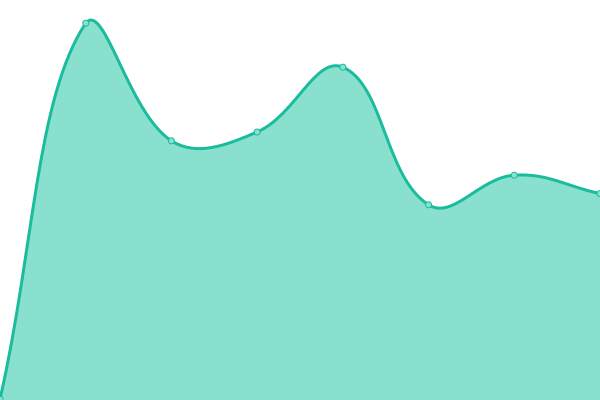
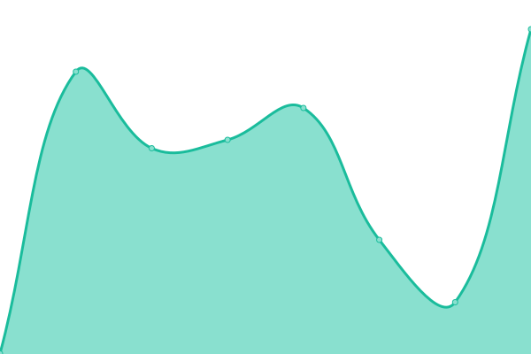
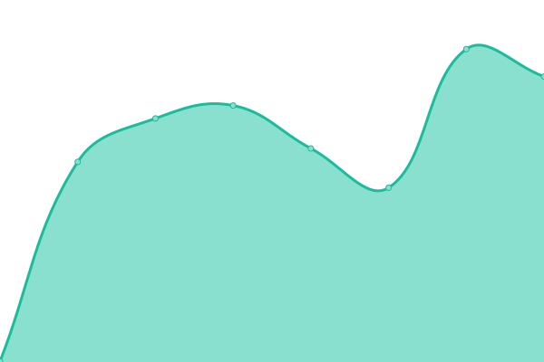

# [📈 Live Status](https://periphery.status.cow.fi): <!--live status--> **🟩 All systems operational**

This repository contains the open-source uptime monitor and status page for [CoW Protocol](cow.fi), powered by [Upptime](https://github.com/upptime/upptime).

With [Upptime](https://upptime.js.org), you can get your own unlimited and free uptime monitor and status page, powered entirely by a GitHub repository. We use [Issues](https://github.com/cowprotocol/uptime-periphery/issues) as incident reports, [Actions](https://github.com/cowprotocol/uptime-periphery/actions) as uptime monitors, and [Pages](https://periphery.status.cow.fi) for the status page.

<!--start: status pages-->
<!-- This summary is generated by Upptime (https://github.com/upptime/upptime) -->
<!-- Do not edit this manually, your changes will be overwritten -->
<!-- prettier-ignore -->
| URL | Status | History | Response Time | Uptime |
| --- | ------ | ------- | ------------- | ------ |
|  [Bridging - Near's 1Click - Get tokens](https://1click.chaindefuser.com/v0/tokens) | 🟩 Up | [bridging-near-s-1-click-get-tokens.yml](https://github.com/cowprotocol/uptime-periphery/commits/HEAD/history/bridging-near-s-1-click-get-tokens.yml) | 

 1254ms
     
 | 

<a href="https://periphery.status.cow.fi/history/bridging-near-s-1-click-get-tokens">99.51%</a>
    

|  [Bridging - Near's 1Click - Get Quote](https://1click.chaindefuser.com/v0/quote) | 🟩 Up | [bridging-near-s-1-click-get-quote.yml](https://github.com/cowprotocol/uptime-periphery/commits/HEAD/history/bridging-near-s-1-click-get-quote.yml) | 

 3334ms
     
 | 

<a href="https://periphery.status.cow.fi/history/bridging-near-s-1-click-get-quote">94.00%</a>
    

|  [Bridging - Bungee - Get tokens](https://backend.bungee.exchange/api/v1/bungee-manual/dest-tokens?toChainId=42161&includeBridges=across%2Ccctp%2Cgnosis-native-bridge&fromChainId=1) | 🟩 Up | [bridging-bungee-get-tokens.yml](https://github.com/cowprotocol/uptime-periphery/commits/HEAD/history/bridging-bungee-get-tokens.yml) | 

 462ms
     
 | 

<a href="https://periphery.status.cow.fi/history/bridging-bungee-get-tokens">100.00%</a>
    

|  [Bridging - Bungee - Get Quote](https://backend.bungee.exchange/api/v1/bungee/quote?userAddress=0xAcaf8cC69BF6BadbEc19c55BC87D2E60Dbc24e2F&originChainId=1&destinationChainId=42161&inputToken=0xa0b86991c6218b36c1d19d4a2e9eb0ce3606eb48&inputAmount=3175278561&receiverAddress=0x79063d9173C09887d536924E2F6eADbaBAc099f5&outputToken=0xaf88d065e77c8cC2239327C5EDb3A432268e5831&includeBridges=across%2Ccctp%2Cgnosis-native-bridge&enableManual=true&disableSwapping=true&disableAuto=true) | 🟩 Up | [bridging-bungee-get-quote.yml](https://github.com/cowprotocol/uptime-periphery/commits/HEAD/history/bridging-bungee-get-quote.yml) | 

 380ms
     
 | 

<a href="https://periphery.status.cow.fi/history/bridging-bungee-get-quote">100.00%</a>
    

<!--end: status pages-->

[**Visit our status website →**](https://periphery.status.cow.fi)

## 📄 License

- Powered by: [Upptime](https://github.com/upptime/upptime)
- Code: [MIT](./LICENSE) © [Anand Chowdhary](https://anandchowdhary.com), supported by [Pabio](https://pabio.com)
- Data in the `./history` directory: [Open Database License](https://opendatacommons.org/licenses/odbl/1-0/)
