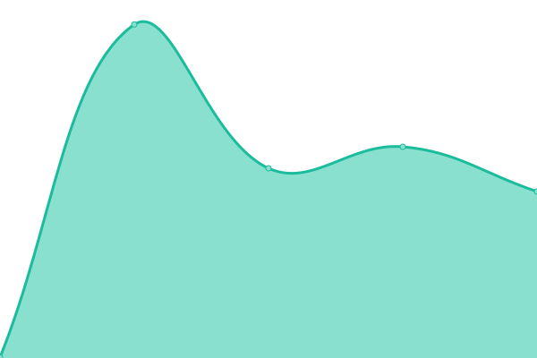
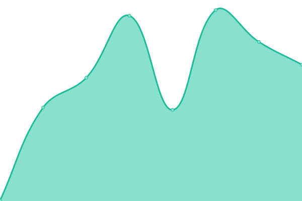
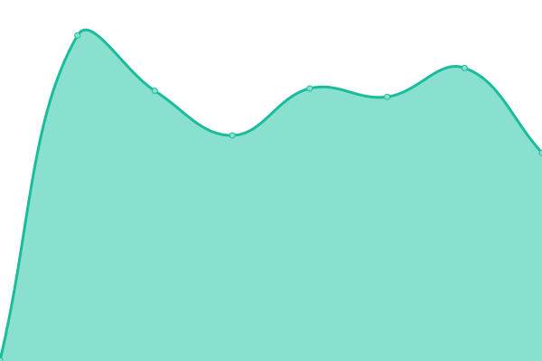

# [📈 Live Status](https://periphery.status.cow.fi): <!--live status--> **🟩 All systems operational**

This repository contains the open-source uptime monitor and status page for [CoW Protocol](cow.fi), powered by [Upptime](https://github.com/upptime/upptime).

With [Upptime](https://upptime.js.org), you can get your own unlimited and free uptime monitor and status page, powered entirely by a GitHub repository. We use [Issues](https://github.com/cowprotocol/uptime-periphery/issues) as incident reports, [Actions](https://github.com/cowprotocol/uptime-periphery/actions) as uptime monitors, and [Pages](https://periphery.status.cow.fi) for the status page.

<!--start: status pages-->
<!-- This summary is generated by Upptime (https://github.com/upptime/upptime) -->
<!-- Do not edit this manually, your changes will be overwritten -->
<!-- prettier-ignore -->
| URL | Status | History | Response Time | Uptime |
| --- | ------ | ------- | ------------- | ------ |
|  [Bridging - Near's 1Click - Get tokens](https://1click.chaindefuser.com/v0/tokens) | 🟩 Up | [bridging-near-s-1-click-get-tokens.yml](https://github.com/cowprotocol/uptime-periphery/commits/HEAD/history/bridging-near-s-1-click-get-tokens.yml) | 

 369ms
     
 | 

<a href="https://periphery.status.cow.fi/history/bridging-near-s-1-click-get-tokens">100.00%</a>
    

|  [Bridging - Near's 1Click - Get Quote](https://1click.chaindefuser.com/v0/quote) | 🟩 Up | [bridging-near-s-1-click-get-quote.yml](https://github.com/cowprotocol/uptime-periphery/commits/HEAD/history/bridging-near-s-1-click-get-quote.yml) | 

 673ms
     
 | 

<a href="https://periphery.status.cow.fi/history/bridging-near-s-1-click-get-quote">100.00%</a>
    

|  [Bridging - Bungee - Get tokens](https://backend.bungee.exchange/api/v1/bungee-manual/dest-tokens?toChainId=42161&includeBridges=across%2Ccctp%2Cgnosis-native-bridge&fromChainId=1) | 🟩 Up | [bridging-bungee-get-tokens.yml](https://github.com/cowprotocol/uptime-periphery/commits/HEAD/history/bridging-bungee-get-tokens.yml) | 

 388ms
     
 | 

<a href="https://periphery.status.cow.fi/history/bridging-bungee-get-tokens">100.00%</a>
    

|  [Bridging - Bungee - Get Quote](https://backend.bungee.exchange/api/v1/bungee/quote?userAddress=0xAcaf8cC69BF6BadbEc19c55BC87D2E60Dbc24e2F&originChainId=1&destinationChainId=42161&inputToken=0xa0b86991c6218b36c1d19d4a2e9eb0ce3606eb48&inputAmount=3175278561&receiverAddress=0x79063d9173C09887d536924E2F6eADbaBAc099f5&outputToken=0xaf88d065e77c8cC2239327C5EDb3A432268e5831&includeBridges=across%2Ccctp%2Cgnosis-native-bridge&enableManual=true&disableSwapping=true&disableAuto=true) | 🟩 Up | [bridging-bungee-get-quote.yml](https://github.com/cowprotocol/uptime-periphery/commits/HEAD/history/bridging-bungee-get-quote.yml) | 

 530ms
     
 | 

<a href="https://periphery.status.cow.fi/history/bridging-bungee-get-quote">100.00%</a>
    

|  [Debug Tool](https://debug.cow.fi/) | 🟩 Up | [debug-tool.yml](https://github.com/cowprotocol/uptime-periphery/commits/HEAD/history/debug-tool.yml) | 

 538ms
     
 | 

<a href="https://periphery.status.cow.fi/history/debug-tool">100.00%</a>
    

|  [Debug Tool API Health](https://debug.cow.fi/api/health) | 🟩 Up | [debug-tool-api-health.yml](https://github.com/cowprotocol/uptime-periphery/commits/HEAD/history/debug-tool-api-health.yml) | 

 518ms
     
 | 

<a href="https://periphery.status.cow.fi/history/debug-tool-api-health">100.00%</a>
    

|  [Debug Tool (Barn)](https://debug.barn.cow.fi/) | 🟩 Up | [debug-tool-barn.yml](https://github.com/cowprotocol/uptime-periphery/commits/HEAD/history/debug-tool-barn.yml) | 

 561ms
     
 | 

<a href="https://periphery.status.cow.fi/history/debug-tool-barn">100.00%</a>
    

|  [Debug Tool API Health (Barn)](https://debug.barn.cow.fi/api/health) | 🟩 Up | [debug-tool-api-health-barn.yml](https://github.com/cowprotocol/uptime-periphery/commits/HEAD/history/debug-tool-api-health-barn.yml) | 

 541ms
     
 | 

<a href="https://periphery.status.cow.fi/history/debug-tool-api-health-barn">100.00%</a>
    

|  [Barn Quote API Mainnet](https://barn.api.cow.fi/mainnet/api/v1/quote) | 🟩 Up | [barn-quote-api-mainnet.yml](https://github.com/cowprotocol/uptime-periphery/commits/HEAD/history/barn-quote-api-mainnet.yml) | 

 4062ms
     
 | 

<a href="https://periphery.status.cow.fi/history/barn-quote-api-mainnet">100.00%</a>
    

|  [Barn Quote API Gnosis Chain](https://barn.api.cow.fi/xdai/api/v1/quote) | 🟩 Up | [barn-quote-api-gnosis-chain.yml](https://github.com/cowprotocol/uptime-periphery/commits/HEAD/history/barn-quote-api-gnosis-chain.yml) | 

 493ms
     
 | 

<a href="https://periphery.status.cow.fi/history/barn-quote-api-gnosis-chain">100.00%</a>
    

|  [Barn Quote API Arbitrum One](https://barn.api.cow.fi/arbitrum_one/api/v1/quote) | 🟩 Up | [barn-quote-api-arbitrum-one.yml](https://github.com/cowprotocol/uptime-periphery/commits/HEAD/history/barn-quote-api-arbitrum-one.yml) | 

 696ms
     
 | 

<a href="https://periphery.status.cow.fi/history/barn-quote-api-arbitrum-one">100.00%</a>
    

|  [Barn Quote API Base](https://barn.api.cow.fi/base/api/v1/quote) | 🟩 Up | [barn-quote-api-base.yml](https://github.com/cowprotocol/uptime-periphery/commits/HEAD/history/barn-quote-api-base.yml) | 

 1206ms
     
 | 

<a href="https://periphery.status.cow.fi/history/barn-quote-api-base">100.00%</a>
    

|  [Barn Quote API Avalanche](https://barn.api.cow.fi/avalanche/api/v1/quote) | 🟩 Up | [barn-quote-api-avalanche.yml](https://github.com/cowprotocol/uptime-periphery/commits/HEAD/history/barn-quote-api-avalanche.yml) | 

 524ms
     
 | 

<a href="https://periphery.status.cow.fi/history/barn-quote-api-avalanche">100.00%</a>
    

|  [Barn Quote API Polygon](https://barn.api.cow.fi/polygon/api/v1/quote) | 🟩 Up | [barn-quote-api-polygon.yml](https://github.com/cowprotocol/uptime-periphery/commits/HEAD/history/barn-quote-api-polygon.yml) | 

 517ms
     
 | 

<a href="https://periphery.status.cow.fi/history/barn-quote-api-polygon">100.00%</a>
    

|  [Barn Quote API BNB](https://barn.api.cow.fi/bnb/api/v1/quote) | 🟩 Up | [barn-quote-api-bnb.yml](https://github.com/cowprotocol/uptime-periphery/commits/HEAD/history/barn-quote-api-bnb.yml) | 

 615ms
     
 | 

<a href="https://periphery.status.cow.fi/history/barn-quote-api-bnb">100.00%</a>
    

|  [Barn Quote API LINEA](https://barn.api.cow.fi/linea/api/v1/quote) | 🟩 Up | [barn-quote-api-linea.yml](https://github.com/cowprotocol/uptime-periphery/commits/HEAD/history/barn-quote-api-linea.yml) | 

 496ms
     
 | 

<a href="https://periphery.status.cow.fi/history/barn-quote-api-linea">100.00%</a>
    

|  [Barn Quote API Ink](https://barn.api.cow.fi/ink/api/v1/quote) | 🟩 Up | [barn-quote-api-ink.yml](https://github.com/cowprotocol/uptime-periphery/commits/HEAD/history/barn-quote-api-ink.yml) | 

 448ms
     
 | 

<a href="https://periphery.status.cow.fi/history/barn-quote-api-ink">100.00%</a>
    

|  [Barn BFF - Slippage Tolerance (mainnet)](https://bff.barn.cow.fi/1/markets/0xDEf1CA1fb7FBcDC777520aa7f396b4E015F497aB-0xC02aaA39b223FE8D0A0e5C4F27eAD9083C756Cc2/slippageTolerance) | 🟩 Up | [barn-bff-slippage-tolerance-mainnet.yml](https://github.com/cowprotocol/uptime-periphery/commits/HEAD/history/barn-bff-slippage-tolerance-mainnet.yml) | 

 1021ms
     
 | 

<a href="https://periphery.status.cow.fi/history/barn-bff-slippage-tolerance-mainnet">100.00%</a>
    

|  [Barn BFF - Slippage Tolerance (Gnosis Chain)](https://bff.barn.cow.fi/100/markets/0x177127622c4a00f3d409b75571e12cb3c8973d3c-0xe91D153E0b41518A2Ce8Dd3D7944Fa863463a97d/slippageTolerance) | 🟩 Up | [barn-bff-slippage-tolerance-gnosis-chain.yml](https://github.com/cowprotocol/uptime-periphery/commits/HEAD/history/barn-bff-slippage-tolerance-gnosis-chain.yml) | 

 949ms
     
 | 

<a href="https://periphery.status.cow.fi/history/barn-bff-slippage-tolerance-gnosis-chain">100.00%</a>
    

|  [Barn BFF - Slippage Tolerance (Arbitrum One)](https://bff.barn.cow.fi/42161/markets/0xcb8b5cd20bdcaea9a010ac1f8d835824f5c87a04-0x82aF49447D8a07e3bd95BD0d56f35241523fBab1/slippageTolerance) | 🟩 Up | [barn-bff-slippage-tolerance-arbitrum-one.yml](https://github.com/cowprotocol/uptime-periphery/commits/HEAD/history/barn-bff-slippage-tolerance-arbitrum-one.yml) | 

 942ms
     
 | 

<a href="https://periphery.status.cow.fi/history/barn-bff-slippage-tolerance-arbitrum-one">100.00%</a>
    

|  [Barn BFF - Slippage Tolerance (Base)](https://bff.barn.cow.fi/8453/markets/0xc694a91e6b071bF030A18BD3053A7fE09B6DaE69-0x4200000000000000000000000000000000000006/slippageTolerance) | 🟩 Up | [barn-bff-slippage-tolerance-base.yml](https://github.com/cowprotocol/uptime-periphery/commits/HEAD/history/barn-bff-slippage-tolerance-base.yml) | 

 940ms
     
 | 

<a href="https://periphery.status.cow.fi/history/barn-bff-slippage-tolerance-base">100.00%</a>
    

|  [Barn BFF - Slippage Tolerance (Avalanche)](https://bff.barn.cow.fi/43114/markets/0x9702230a8ea53601f5cd2dc00fdbc13d4df4a8c7-0xb31f66aa3c1e785363f0875a1b74e27b85fd66c7/slippageTolerance) | 🟩 Up | [barn-bff-slippage-tolerance-avalanche.yml](https://github.com/cowprotocol/uptime-periphery/commits/HEAD/history/barn-bff-slippage-tolerance-avalanche.yml) | 

 1054ms
     
 | 

<a href="https://periphery.status.cow.fi/history/barn-bff-slippage-tolerance-avalanche">100.00%</a>
    

|  [Barn BFF - Slippage Tolerance (Polygon)](https://bff.barn.cow.fi/137/markets/0x8f3Cf7ad23Cd3CaDbD9735AFf958023239c6A063-0x0d500b1d8e8ef31e21c99d1db9a6444d3adf1270/slippageTolerance) | 🟩 Up | [barn-bff-slippage-tolerance-polygon.yml](https://github.com/cowprotocol/uptime-periphery/commits/HEAD/history/barn-bff-slippage-tolerance-polygon.yml) | 

 997ms
     
 | 

<a href="https://periphery.status.cow.fi/history/barn-bff-slippage-tolerance-polygon">100.00%</a>
    

|  [Barn BFF - USD Price (mainnet)](https://bff.barn.cow.fi/1/tokens/0xc02aaa39b223fe8d0a0e5c4f27ead9083c756cc2/usdPrice) | 🟩 Up | [barn-bff-usd-price-mainnet.yml](https://github.com/cowprotocol/uptime-periphery/commits/HEAD/history/barn-bff-usd-price-mainnet.yml) | 

 509ms
     
 | 

<a href="https://periphery.status.cow.fi/history/barn-bff-usd-price-mainnet">100.00%</a>
    

|  [Barn BFF - USD Price (Gnosis Chain)](https://bff.barn.cow.fi/100/tokens/0xe91D153E0b41518A2Ce8Dd3D7944Fa863463a97d/usdPrice) | 🟩 Up | [barn-bff-usd-price-gnosis-chain.yml](https://github.com/cowprotocol/uptime-periphery/commits/HEAD/history/barn-bff-usd-price-gnosis-chain.yml) | 

 514ms
     
 | 

<a href="https://periphery.status.cow.fi/history/barn-bff-usd-price-gnosis-chain">100.00%</a>
    

|  [Barn BFF - USD Price (Arbitrum One)](https://bff.barn.cow.fi/42161/tokens/0x82aF49447D8a07e3bd95BD0d56f35241523fBab1/usdPrice) | 🟩 Up | [barn-bff-usd-price-arbitrum-one.yml](https://github.com/cowprotocol/uptime-periphery/commits/HEAD/history/barn-bff-usd-price-arbitrum-one.yml) | 

 492ms
     
 | 

<a href="https://periphery.status.cow.fi/history/barn-bff-usd-price-arbitrum-one">100.00%</a>
    

|  [Barn BFF - USD Price (Base)](https://bff.barn.cow.fi/8453/tokens/0x4200000000000000000000000000000000000006/usdPrice) | 🟩 Up | [barn-bff-usd-price-base.yml](https://github.com/cowprotocol/uptime-periphery/commits/HEAD/history/barn-bff-usd-price-base.yml) | 

 528ms
     
 | 

<a href="https://periphery.status.cow.fi/history/barn-bff-usd-price-base">100.00%</a>
    

|  [Barn BFF - USD Price (Avalanche)](https://bff.barn.cow.fi/43114/tokens/0xb31f66aa3c1e785363f0875a1b74e27b85fd66c7/usdPrice) | 🟩 Up | [barn-bff-usd-price-avalanche.yml](https://github.com/cowprotocol/uptime-periphery/commits/HEAD/history/barn-bff-usd-price-avalanche.yml) | 

 521ms
     
 | 

<a href="https://periphery.status.cow.fi/history/barn-bff-usd-price-avalanche">100.00%</a>
    

|  [Barn BFF - USD Price (Polygon)](https://bff.barn.cow.fi/137/tokens/0x0d500b1d8e8ef31e21c99d1db9a6444d3adf1270/usdPrice) | 🟩 Up | [barn-bff-usd-price-polygon.yml](https://github.com/cowprotocol/uptime-periphery/commits/HEAD/history/barn-bff-usd-price-polygon.yml) | 

 502ms
     
 | 

<a href="https://periphery.status.cow.fi/history/barn-bff-usd-price-polygon">100.00%</a>
    

<!--end: status pages-->

[**Visit our status website →**](https://periphery.status.cow.fi)

## 📄 License

- Powered by: [Upptime](https://github.com/upptime/upptime)
- Code: [MIT](./LICENSE) © [Anand Chowdhary](https://anandchowdhary.com), supported by [Pabio](https://pabio.com)
- Data in the `./history` directory: [Open Database License](https://opendatacommons.org/licenses/odbl/1-0/)
